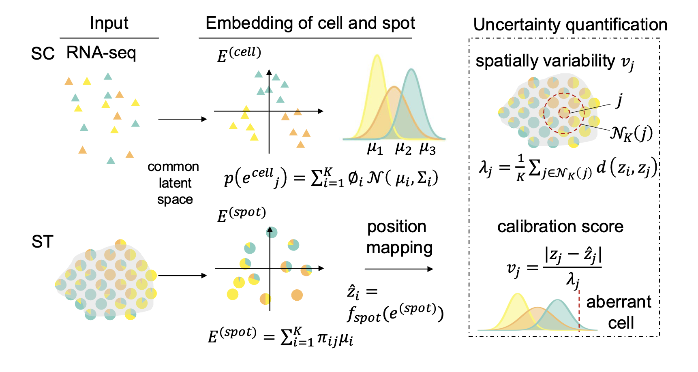

# SCAD: Spatially Conformal Aberrant Detection

[](LICENSE)
[](https://www.python.org/)
[](https://www.sciencedirect.com/journal/genomics-proteomics-and-bioinformatics)




**SCAD** is a computational framework designed to integrate single-cell RNA sequencing (scRNA-seq) and spatial transcriptomics (ST) data to quantitatively characterize and detect spatially aberrant cells. SCAD integrates scRNA-seq and spatial transcriptomics (ST) data through two independent autoencoders to generate latent embeddings for cells and spatial spots. Cell embeddings are modeled as cluster-aware latent representations using a Gaussian mixture model (GMM), where each component represents a distinct cell-type embedding. Each spot embedding is then decomposed into a weighted combination of GMM component centers, reflecting its underlying cellular composition. 
SCAD further learns a spatial mapping from ST embeddings to their physical coordinates, enabling reconstruction of tissue architecture. Spatially aberrant spots are subsequently identified as outliers in this mapping using an uncertainty quantification framework.
1.  **Joint Embedding:** Mapping scRNA-seq cells and ST spots into a shared latent space using a VAE.
2.  **Deconvolution:** Modeling ST spots as a weighted combination of cell-type embeddings (GMM components) to mitigate batch effects.
3.  **Spatial Mapping:** Learning a mapping from latent embeddings to physical coordinates.
4.  **Uncertainty Quantification:** Utilizing **Conformal Prediction** to generate statistically rigorous prediction intervals, identifying spots whose true location deviates significantly from their predicted location.

## ✨ Key Features

*   **Uncertainty-Calibrated Detection:** Unlike methods relying on arbitrary thresholds, SCAD uses conformal prediction to provide statistically principled detection with controlled false discovery rates.
*   **Integration:** Seamlessly integrates scRNA-seq and Spatial Transcriptomics data.

## 🛠️ Installation

To run SCAD, you will need Python (3.8+) and the following dependencies:
- Python ≥ 3.8
- PyTorch ≥ 1.10
- Scanpy, anndata, pandas, numpy, scikit‑learn, scipy 

### Install from source
```bash
git clone https://github.com/zhangzheng0131/SCAD.git
cd SCAD
pip install -r requirements.txt
```
---

## 🚀 Quick Start

A complete example script `run_scad.ipynb` is provided in the repository. It demonstrates the full pipeline on  human squamous cell carcinoma (SCC) data.

### 1. Prepare your data
- **scRNA‑seq**: AnnData object (cells × genes) with `.X` as expression matrix.
- **ST**: AnnData object (spots × genes) with `.obsm['spatial']` as 2D coordinates.
- **SVG list**: A list of spatially variable genes (e.g., from SpaGCN) to guide feature selection.

### 2. Configure paths
Edit the configuration section in `run_scad.ipynb`:

First, download the required data from Google Drive and place it into the `data` folder.
- ST data (adata_SCC_ST.h5ad): https://drive.google.com/file/d/1lk-un3yXyT4cM8gNCRcWE5ujgi5KHn6W/view?usp=sharing

- sc data: https://drive.google.com/file/d/1TywXKtjBq6UYGxlWW9NFRybd1Sfznwhb/view?usp=sharing

- Others intermediate files: e.g. SVG list (svb-enhanced-scc.csv from [data folder](https://github.com/zhangzheng0131/SCAD/blob/main/data/mapping_SCC.txt)) and the google drive folder : https://drive.google.com/file/d/1f1xCALl_eUZ49eq5kQrzdsSNafgN2NcB/view?usp=sharing 

### 3. Run the pipeline example 


This will:
 1. Preprocess 
-  (1) using TESLA to get ST data with higher resolution (see example in tutorial_TESLA.ipynb, the result is saved in enhanced_exp.h5ad)
-  (2) using SpaGCN to obtain spatial variable genes (see example in tutorial_SpaGCN.ipynb)
2. Train the VAE‑GMM model (step 2 to 5 is in run_scad.ipynb)
3. Predict spatial coordinates for each spot
4. Apply conformal prediction to detect aberrant spots
5. Save results (predicted coordinates, aberrant labels, deconvolution scores, latent embeddings) 

---


## 📊 Usage Example (Code Snippet)

### Model Training and Conformal Prediction Pipeline

This section outlines the complete workflow for training the SCAD models across three cross-validation folds, performing conformal prediction, and aggregating the final results.

#### Training Fold 1
Initialize the model with specified hyperparameters, train on the first split of indices, evaluate to extract latent variables, and save the network parameters.

```python
# %% Cell 2 - Train Model Fold 1
print("=== Training Fold 1 ===")
model1 = scad.Model3(
    resolution="low",
    batch_size=200,
    train_epoch=3000,
    cut_steps=0.5,
    sf_coord=50,
    rad_cutoff=1.2,
    seed=1234,
    lambdacos=10,
    lambdaSWD=5,
    lambdalat=10,
    lambdarec=0.1,
    model_path=model_path,
    data_path=data_path,
    result_path=result_path,
    ot=False,
    device="cpu"
)
K, cluster = model1.preprocess(svg_list, adata_sc, adata_ST, res=0.5)
training_idx_st = np.array(splits[0][0])
model1.train(training_idx_rna, training_idx_st)
mu1, phi1, sigma1, z_A1, z_B1, m_A1, m_B1 = model1.eval2()
val_idx1, test_idx1 = np.array(splits[0][1]), np.array(splits[0][2])

# Save parameters for Model 1
torch.save({
    'D_A': model1.D_A.state_dict(),
    'D_B': model1.D_B.state_dict(),
    'E_A': model1.E_A.state_dict(),
    'E_B': model1.E_B.state_dict(),
    'G_A': model1.G_A.state_dict(),
    'G_B': model1.G_B.state_dict(),
    'E_s': model1.E_s.state_dict()
}, os.path.join(model_path, "model1.pth"))
```

#### Training Fold 2
Train the second fold using the identical architecture and hyperparameters, utilizing the second set of split indices, and save the resulting weights.

```python
# %% Cell 3 - Train Model Fold 2
print("=== Training Fold 2 ===")
model2 = scad.Model3(
    resolution="low",
    batch_size=200,
    train_epoch=3000,
    cut_steps=0.5,
    sf_coord=50,
    rad_cutoff=1.2,
    seed=1234,
    lambdacos=10,
    lambdaSWD=5,
    lambdalat=10,
    lambdarec=0.1,
    model_path=model_path,
    data_path=data_path,
    result_path=result_path,
    ot=False,
    device="cpu"
)
K, cluster = model2.preprocess(svg_list, adata_sc, adata_ST, res=0.5)
training_idx_st = np.array(splits[1][0])
model2.train(training_idx_rna, training_idx_st)
mu2, phi2, sigma2, z_A2, z_B2, m_A2, m_B2 = model2.eval2()
val_idx2, test_idx2 = np.array(splits[1][1]), np.array(splits[1][2])

torch.save({
    'D_A': model2.D_A.state_dict(),
    'D_B': model2.D_B.state_dict(),
    'E_A': model2.E_A.state_dict(),
    'E_B': model2.E_B.state_dict(),
    'G_A': model2.G_A.state_dict(),
    'G_B': model2.G_B.state_dict(),
    'E_s': model2.E_s.state_dict()
}, os.path.join(model_path, "model2.pth"))
```

#### Training Fold 3
Complete the cross-validation process by training the third fold with its respective split indices and saving the final set of model weights.

```python
# %% Cell 4 - Train Model Fold 3
print("=== Training Fold 3 ===")
model3 = scad.Model3(
    resolution="low",
    batch_size=200,
    train_epoch=3000,
    cut_steps=0.5,
    sf_coord=50,
    rad_cutoff=1.2,
    seed=1234,
    lambdacos=10,
    lambdaSWD=5,
    lambdalat=10,
    lambdarec=0.1,
    model_path=model_path,
    data_path=data_path,
    result_path=result_path,
    ot=False,
    device="cpu"
)
K, cluster = model3.preprocess(svg_list, adata_sc, adata_ST, res=0.5)
training_idx_st = np.array(splits[2][0])
model3.train(training_idx_rna, training_idx_st)
mu3, phi3, sigma3, z_A3, z_B3, m_A3, m_B3 = model3.eval2()
val_idx3, test_idx3 = np.array(splits[2][1]), np.array(splits[2][2])

torch.save({
    'D_A': model3.D_A.state_dict(),
    'D_B': model3.D_B.state_dict(),
    'E_A': model3.E_A.state_dict(),
    'E_B': model3.E_B.state_dict(),
    'G_A': model3.G_A.state_dict(),
    'G_B': model3.G_B.state_dict(),
    'E_s': model3.E_s.state_dict()
}, os.path.join(model_path, "model3.pth"))
```

#### Conformal Prediction and Result Aggregation
Apply conformal prediction to each fold's validation and test sets to identify spatial aberrations. Aggregate the results by summing the flags (flagging if detected in at least one fold) and merging the predicted coordinates based on their respective test/validation indices.

```python
# %% Cell 5 - Aggregate Results and Perform Conformal Prediction
print("=== Performing Conformal Prediction ===")
true_coord = adata_ST.obsm['spatial']

final_aberrant1, final_confidence1, final_lambda1, pred_coords1, _ = scad.conformal_prediction(
    true_coord, z_B1, m_B1, val_idx1, test_idx1, alpha=0.05)

final_aberrant2, final_confidence2, final_lambda2, pred_coords2, _ = scad.conformal_prediction(
    true_coord, z_B2, m_B2, val_idx2, test_idx2, alpha=0.05)

final_aberrant3, final_confidence3, final_lambda3, pred_coords3, _ = scad.conformal_prediction(
    true_coord, z_B3, m_B3, val_idx3, test_idx3, alpha=0.05)

# Aggregate results from three folds (summing yields final determination; 
# flagged as aberrant if detected in at least one fold)
final_aberrant = final_aberrant1 + final_aberrant2 + final_aberrant3
final_lambda = final_lambda1 + final_lambda2 + final_lambda3

# Aggregate predicted coordinates: use Model 3 predictions as baseline, 
# then replace with respective fold predictions based on test set indices
final_predict = pred_coords3.clone()
test_list1 = val_idx1.tolist() + test_idx1.tolist()
test_list2 = val_idx2.tolist() + test_idx2.tolist()
test_list3 = val_idx3.tolist() + test_idx3.tolist()
final_predict[test_list1, :] = pred_coords1[test_list1, :]
final_predict[test_list2, :] = pred_coords2[test_list2, :]
final_predict[test_list3, :] = pred_coords3[test_list3, :]  # Already model3 values, kept for consistency
```

#### Saving Final Outputs
Map the aggregated predictions and error metrics back to the original spatial transcriptomics object using index mapping. Export the observation metadata to a tab-separated file and save all intermediate evaluation variables in a compressed `.npz` format for downstream analysis.

```python
# Save results to the original ST object (note index mapping)
adata_ST0 = sc.read_h5ad('data/adata_SCC_ST.h5ad')  # Replace with actual path
mapping_TESLA = pd.read_csv('data/mapping_SCC.txt', sep='\t')
mapping_TESLA.index = mapping_TESLA['ori_index']

pred_error = np.zeros((adata_ST0.shape[0], 1))
pred_error[:, 0] = np.sqrt(((final_predict - true_coord) ** 2).sum(axis=1))[mapping_TESLA.loc[list(range(666))]['target_index']]
adata_ST0.obs['pred_error'] = pred_error

pred_abb = np.zeros((adata_ST0.shape[0], 1))
pred_abb[:, 0] = final_aberrant[mapping_TESLA.loc[list(range(666))]['target_index']]
adata_ST0.obs['pred_abb'] = pred_abb

adata_ST0.obs['nonconformityscore'] = final_lambda[mapping_TESLA.loc[list(range(666))]['target_index']]
adata_ST0.obs.to_csv(os.path.join(result_path, 'spot_info_SCC.txt'), sep='\t')

# Save all intermediate evaluation results
np.savez(os.path.join(result_path, 'eval_out.npz'),
         true_coord=true_coord,
         z_B1=z_B1, m_B1=m_B1, val_idx1=val_idx1, test_idx1=test_idx1,
         z_B2=z_B2, m_B2=m_B2, val_idx2=val_idx2, test_idx2=test_idx2,
         z_B3=z_B3, m_B3=m_B3, val_idx3=val_idx3, test_idx3=test_idx3,
         final_predict=final_predict, final_lambda=final_lambda)

print("All results saved successfully.")
```


## 📈 Performance Highlights

- **Simulated mouse brain**: AUC = 0.991, AUPR = 0.81, recall = 90.5% with FPR < 5%.
- **Human SCC**: Identified 22 aberrant spots enriched in tumor‑specific keratin (TSK) regions and domains with high spatial variability. Detected genes (e.g., *EIF2AK1*, *TMSB15B*) associated with stress response and migration.
- **Xenium breast cancer**: Detected 6,544 aberrant cells enriched at invasive fronts and DCIS regions, capturing biologically meaningful heterogeneity.
- **State‑of‑the‑art comparison**: SCAD outperforms STALocator and scSpace in spatial mapping accuracy across multiple thresholds.

---

## 🧪 Customization

### Adjusting conformal prediction
- `alpha` – controls the nominal false discovery rate (default 0.05).
- `k_neighbors` – number of neighbors for local variability estimation (default 15).
- Increase `alpha` for stricter detection; decrease for more conservative.

### Model hyperparameters
Key parameters in `Model3`:
- `resolution` – `"low"` (coarse mapping) or `"high"` (enhanced single‑cell resolution, requires optimal transport).
- `train_epoch` – training epochs (default 3000; increase for larger datasets).
- `lambdaGAN`, `lambdacos`, `lambdaAE`, `lambdaLA`, `lambdaSWD` – loss weights for different objectives.

---


## 📜 License

This project is licensed under the MIT License – see the [LICENSE](LICENSE) file for details.

---

**Happy spatial anomaly hunting!** 🧬🔬

